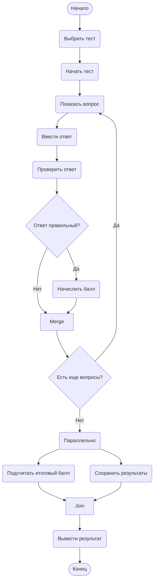

# Практическая работа №15: Диаграмма деятельности
## Тема: Прохождение теста в системе онлайн-обучения

## Описание процесса
Пользователь выбирает тест из доступных, запускает его. Система последовательно показывает вопросы, пользователь вводит ответы. После каждого ответа система проверяет правильность и при необходимости начисляет балл. Если остались вопросы, процесс повторяется. Когда все вопросы отвечены, параллельно выполняются подсчёт итогового балла и сохранение результатов в базу данных. Затем выводится итоговый результат тестирования.

## Диаграмма

## Контрольные вопросы

1. **Что такое диаграмма деятельности и для чего она используется?**  
   Диаграмма деятельности (Activity Diagram) – вид диаграмм UML, моделирующий динамику системы: последовательность действий, условия ветвления, параллельные потоки и синхронизацию. Используется для визуализации алгоритмов, бизнес-процессов, сценариев использования, выявления параллельных потоков.

2. **Чем диаграмма деятельности отличается от блок-схемы?**  
   Блок-схема показывает алгоритм шаг за шагом, не поддерживая параллелизм и синхронизацию. Диаграмма деятельности позволяет моделировать параллельные потоки (fork/join), распределение ответственности (swimlanes) и более сложные динамические аспекты.

3. **Как обозначается начальный узел в Mermaid?**  
   Синтаксис `([*])` – закрашенный кружок. Например: `Start([*])`.

4. **Как обозначается узел решения (ветвление)?**  
   С помощью фигурных скобок: `id{Текст}` – ромб. Пример: `IsCorrect{Ответ правильный?}`.

5. **Как в Mermaid реализовать параллельные ветви (fork/join)?**  
   Прямой поддержки символов «жирная черта» нет, но параллелизм моделируется созданием нескольких исходящих стрелок из одного узла (fork) и сведением нескольких стрелок в один узел (join). Для наглядности можно ввести промежуточные узлы с текстом «Разделение» и «Соединение».

6. **Зачем нужны узлы слияния (merge) и соединители (join)?**  
   Merge (слияние) сводит несколько альтернативных потоков (например, после ветвления) в один без синхронизации – продолжается тот поток, который пришёл первым. Join (соединитель) синхронизирует параллельные потоки: дальнейшее выполнение возможно только после завершения всех входящих ветвей.

7. **Какие правила именования действий вы знаете?**  
   Действия рекомендуется называть глаголами в неопределённой форме (например, «Проверить», «Вычислить», «Сохранить»). Название должно быть кратким и отражать суть выполняемого шага.

8. **Можно ли на одной диаграмме деятельности иметь несколько конечных узлов?**  
   Да, диаграмма может содержать несколько конечных узлов. Это полезно, когда процесс завершается разными способами (например, успешное завершение и завершение с ошибкой). Каждый конечный узел обозначается кружком с точкой внутри.