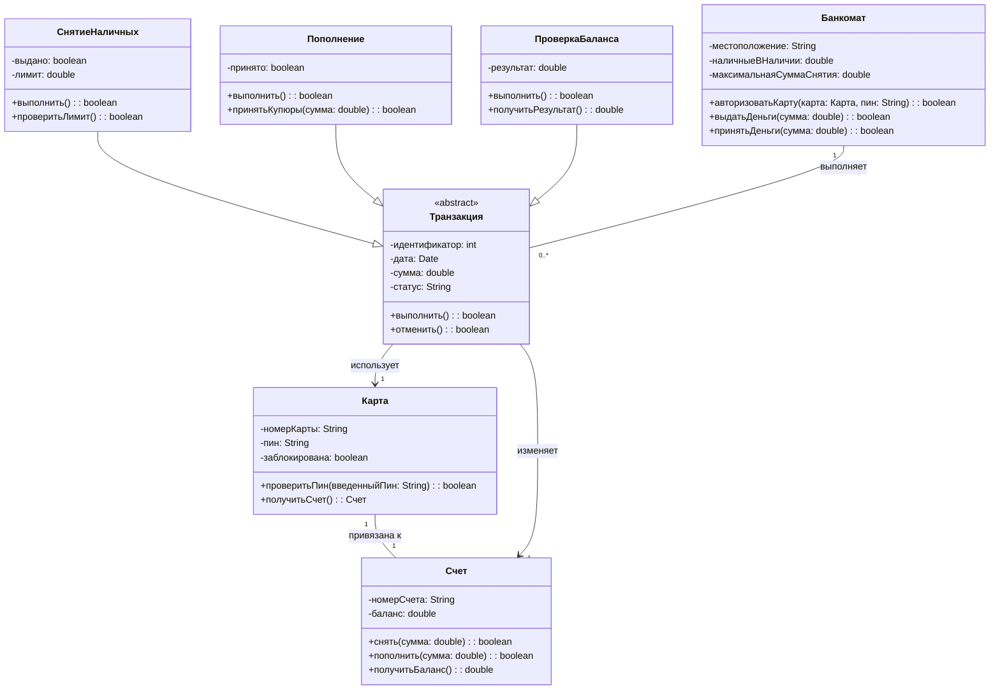

# Диаграмма классов: Банкомат (ATM)

## Описание предметной области

Система банкомата позволяет клиентам проверять баланс, снимать и вносить наличные. Инкассаторы загружают деньги и собирают выручку. Банковская система обрабатывает транзакции и проверяет подлинность карт. Каждая операция (снятие, пополнение, проверка баланса) является транзакцией, которая обязательно проходит авторизацию по карте.

Основные классы:

- Карта — средство доступа к счету.

- Счет — хранит деньги клиента.

- Транзакция (абстрактный) — общий предок для всех операций.

- СнятиеНаличных, Пополнение, ПроверкаБаланса — конкретные типы транзакций.

- Банкомат — устройство, выполняющее операции.


## Список классов с пояснением их роли

- **Карта** - Хранит номер карты, PIN-код и статус блокировки. Позволяет проверить PIN и получить связанный счёт. Является ключом доступа клиента к системе.
- **Счёт** - Содержит номер счёта и текущий баланс. Предоставляет методы для снятия, пополнения и получения остатка. Именно счёт хранит деньги клиента.
- **Транзакция** - Абстрактный базовый класс для всех операций. Хранит идентификатор, дату, сумму и статус. Определяет общее поведение: выполнить и отменить операцию.
- **СнятиеНаличных** - Конкретная транзакция выдачи денег. Добавляет флаг выдачи и дневной лимит. Переопределяет метод выполнения, проверяя достаточность средств и лимит.
- **Пополнение** - Конкретная транзакция внесения наличных. Фиксирует факт приёма купюр. Выполняет зачисление на счёт.
- **ПроверкаБаланса** - Конкретная транзакция запроса остатка. Сохраняет результат и возвращает его клиенту.
- **Банкомат** - Устройство, расположенное в определённом месте. Хранит количество доступных наличных и максимальную сумму снятия. Умеет авторизовать карту, выдавать и принимать деньги.

## Описание ключевых отношений

- **СнятиеНаличных --|> Транзакция**: Наследование — СнятиеНаличных является разновидностью Транзакции. Оно наследует все атрибуты (идентификатор, дата, сумма, статус) и методы (выполнить, отменить), добавляя свою специфику (лимит, флаг выдачи).
- **Пополнение --|> Транзакция**: Наследование — Пополнение также является разновидностью Транзакции.
- **ПроверкаБаланса --|> Транзакция**: Наследование — ПроверкаБаланса — разновидность Транзакции.
- **Карта "1" -- "1" Счет**: Ассоциация (один к одному) — одна карта привязана ровно к одному счёту, и наоборот. Карта не может существовать без счёта (в рамках системы банкомата).
- **Банкомат "1" -- "0..*" Транзакция**: Ассоциация (один ко многим) — один банкомат выполняет много транзакций. Транзакция не привязана жёстко к банкомату (может храниться в журнале), поэтому это не композиция.
- **Транзакция --> Карта**: Ассоциация (многие к одному) — каждая транзакция использует ровно одну карту.
- **Транзакция --> Счет**: Ассоциация (многие к одному) — каждая транзакция изменяет ровно один счёт.

## Объяснение выбранных типов связей

**Наследование (`СнятиеНаличных --|> Транзакция`, `Пополнение --|> Транзакция`, `ПроверкаБаланса --|> Транзакция`)**  
Все три конкретные операции имеют общие атрибуты (id, дата, сумма, статус) и общее поведение (выполнить, отменить). Вынесение их в абстрактный класс Транзакция устраняет дублирование и позволяет банкомату работать с любым типом операций полиморфно.

**Композиция (...)**  
В данной модели нет жёсткой композиции (`*--`), потому что ни одна часть не уничтожается вместе с целым безусловно. Например, транзакции сохраняются в логе даже после замены банкомата. Поэтому используется агрегация или простая ассоциация.

**Ассоциация «один к одному» (`Карта "1" -- "1" Счет`)**  
Карта и счёт неразрывно связаны: карта указывает на конкретный счёт, счёт «принадлежит» карте (в контексте банкомата). Это естественная зависимость.

**Ассоциация «один ко многим» (`Банкомат "1" -- "0..*" Транзакция`)**  
Банкомат выполняет множество транзакций, но транзакция не «принадлежит» банкомату намертво — она может быть перенесена в архив или обработана другим устройством.

**Ассоциация «многие к одному» (`Транзакция --> Карта`, `Транзакция --> Счет`)**  
Каждая транзакция ссылается ровно на одну карту и один счёт. Это отражает реальность: операция не может быть без карты и без счёта.

**Почему нет агрегации?**  
Агрегация (`o--`) означала бы, что часть может существовать отдельно от целого и переходить от одного целого к другому. Например, игрок может перейти из одной команды в другую. В банкомате транзакция не переходит от одного банкомата к другому — она привязана к тому месту, где была выполнена. Поэтому достаточно простой ассоциации.

## Контрольные вопросы
## 1. Что такое диаграмма классов и для чего она используется?

Диаграмма классов — это основной вид диаграмм статической структуры в UML. Она показывает классы системы, их атрибуты, методы и связи между ними. Используется для документирования архитектуры, генерации кода и проектирования баз данных.

---

## 2. Какие три основные секции имеет прямоугольник класса?

    Имя класса (обязательно, жирным шрифтом).

    Атрибуты (свойства класса с указанием видимости и типа).

    Методы (операции с видимостью, параметрами и возвращаемым типом).

---

## 3. Что означают символы ‘+’, ‘-’, ‘#’ перед атрибутами и методами?

    + — public (доступен всем).

    - — private (доступен только внутри класса).

    # — protected (доступен внутри класса и его наследникам).

---

## 4. Как в Mermaid обозначается наследование?

ChildClass --|> ParentClass

---

## 5. В чём разница между агрегацией и композицией?

Агрегация (o--) — часть может существовать независимо от целого (например, игрок может перейти в другую команду).

Композиция (*--) — часть не может существовать без целого (например, комнаты не существуют без дома).

---

## 6. Как указать множественность отношения (например, «один ко многим»)?

В Mermaid множественность указывается в кавычках у концов связи:

```
ParentClass "1" -- "0..*" ChildClass
```

---

## 7. Как изобразить интерфейс в Mermaid?

```
classDiagram
    class НазваниеИнтерфейса {
        <<interface>>
        +метод(): тип
    }
```
---

## 8. Какую информацию можно указать в сигнатуре метода?

    Видимость (+, -, #)

    Имя метода

    Параметры (имя и тип, возможно значение по умолчанию)

    Возвращаемый тип


