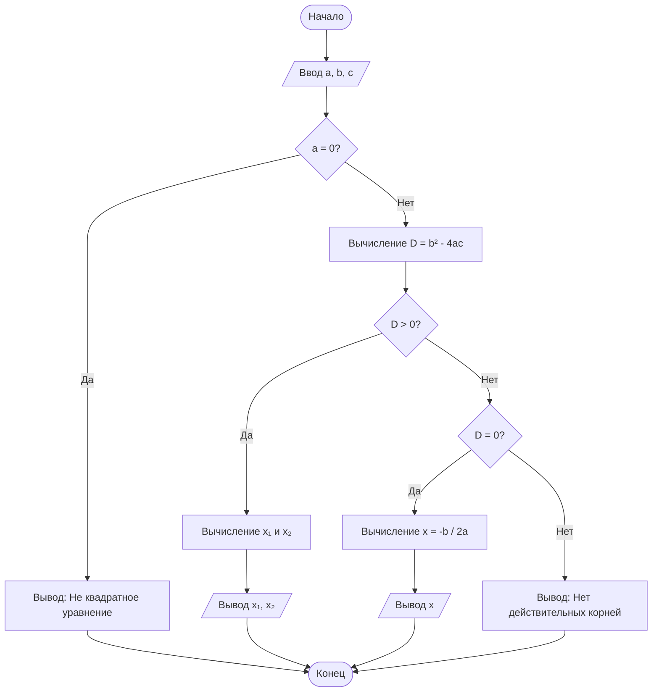

# Блок-схема алгоритма: Решение квадратного уравнения

**Описание алгоритма:**

Данный алгоритм решает квадратное уравнение вида **ax² + bx + c = 0**.  
На вход подаются коэффициенты `a`, `b`, `c`.  
Алгоритм вычисляет дискриминант (`D = b² - 4ac`), затем в зависимости от его значения определяет количество и значения корней:

- Если `D < 0` → корней нет (вывод сообщения)
- Если `D = 0` → один корень: `x = -b / (2a)`
- Если `D > 0` → два корня: 
  `x₁ = (-b + √D) / (2a)`  
  `x₂ = (-b - √D) / (2a)`

Результат выводится на экран.

---

## Диаграмма



## Контрольные вопросы
 
**1. Что такое Mermaid и для чего он используется?**
 
Mermaid – это язык разметки для создания диаграмм и схем непосредственно в текстовом виде. Он используется для встраивания диаграмм в Markdown-документы без использования внешних графических редакторов.
 
**2. Как вставить диаграмму в Markdown-документ?**
 
Диаграмма вставляется с помощью блока кода с указанием языка `mermaid`:
 
```markdown
\```mermaid
flowchart TD
    Start --> Stop
\```
```
 
**3. Какие типы узлов (фигур) доступны в блок-схемах Mermaid?**
 
| Форма | Синтаксис | Назначение |
|-------|-----------|-------------|
| Прямоугольник | `id[Текст]` | Процесс |
| Скругленный | `id(Текст)` | Процесс |
| Ромб | `id{Текст}` | Условие |
| Овал | `id([Текст])` | Начало/конец |
| Параллелограмм | `id[/Текст/]` | Ввод/вывод |
 
**4. Чем отличаются стрелки `-->` и `-- текст -->`?**
 
- `-->` – простая стрелка без подписи
- `-- текст -->` – стрелка с текстовой подписью (используется для обозначения условий "Да"/"Нет")
 
**5. Как изменить ориентацию диаграммы с вертикальной на горизонтальную?**
 
Изменить направление графа:
- `TD` (Top-Down) – сверху вниз (вертикальная)
- `LR` (Left-Right) – слева направо (горизонтальная)
 
**6. Зачем нужны подграфы (subgraph)?**
 
Подграфы позволяют группировать связанные узлы для логического структурирования сложных диаграмм.
 
**7. Какие символы нельзя использовать в идентификаторах узлов?**
 
В идентификаторах узлов нельзя использовать: пробелы, знаки препинания, кавычки, скобки, специальные символы.
 
**8. Почему важно указывать начальный и конечный узлы?**
 
Начальный и конечный узлы явно обозначают границы алгоритма, делая блок-схему полной и понятной для чтения.
